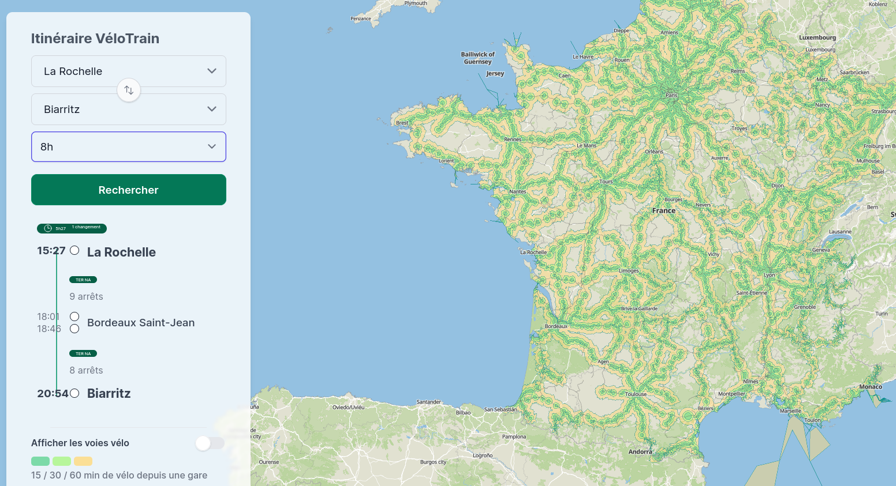
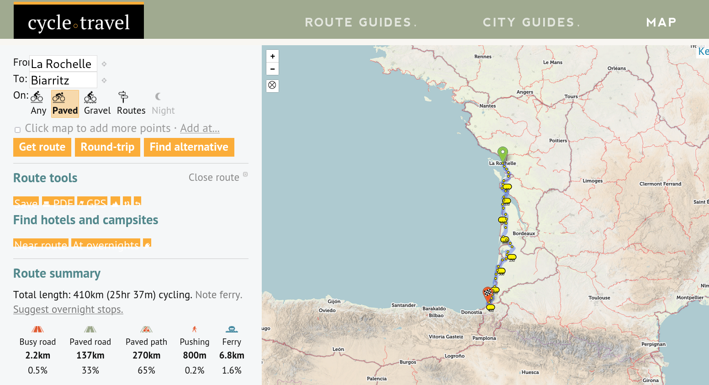

# Biking adventures - where to start

## La carte de France du vélo train

This one is really useful to figure out the least painful way to bring your bike with you when travelling by train in France.

[velotrain.fr](https://velotrain.fr/)

## Planning multiday bike rides accross 

Looks super useful, it seems to cover at least Europe, North America and Australia, maybe more ? You can select paved/gravel/routes as a mode and it will adapt the itinerary. Also very useful to find campsites and accomodation near your route.

[cycle.travel](https://cycle.travel)